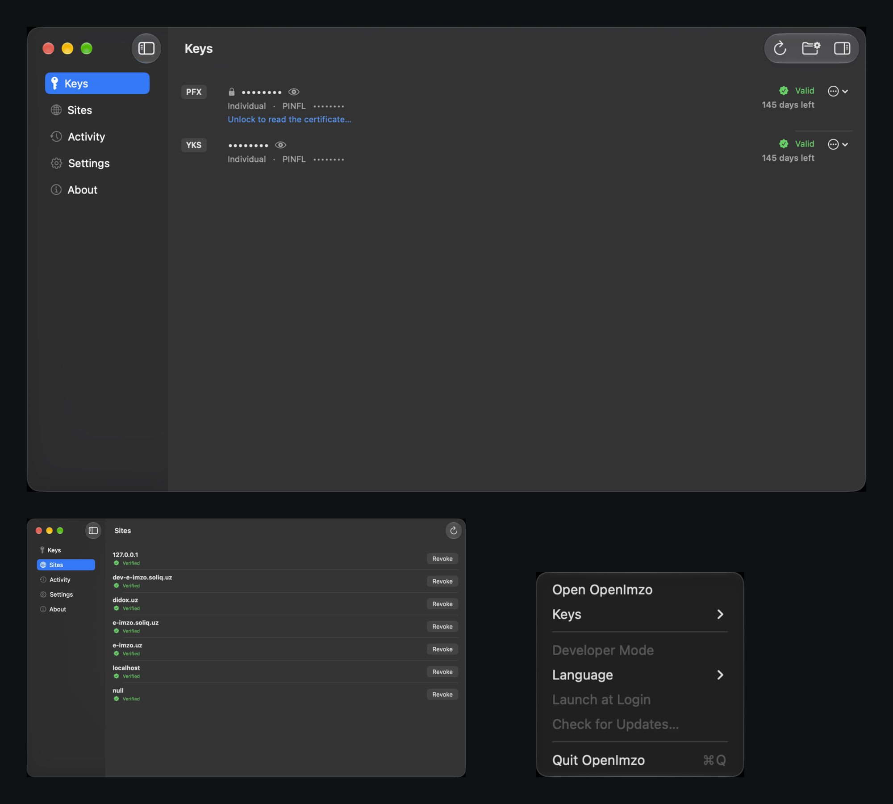
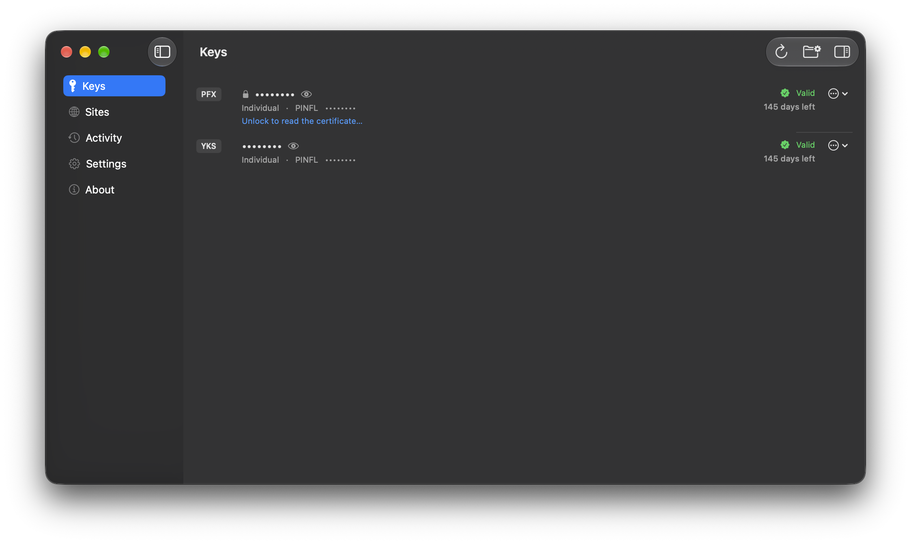

<h1 align="center">OpenImzo</h1>

<p align="center">
  A native macOS client for Uzbekistan's national e-signature system.<br>
  Compatible with E-IMZO. Open source, so you can read exactly what it does with your key.
</p>

<p align="center">
  <a href="https://github.com/ganiyevuz/openimzo/releases/latest"></a>
  <a href="LICENSE"></a>
  <a href="https://github.com/ganiyevuz/openimzo/actions/workflows/ci.yml"></a>
  
</p>

<p align="center">
  
</p>

---

Uzbek government and business websites need a local signing service running on your machine
before they can sign anything with your national digital-signature key. The original is a
Java desktop client. OpenImzo is an independent, from-scratch replacement for it on macOS:
it listens on the same local ports, speaks the same protocol, and is a native app whose
entire source you can read, build, and check yourself.

> **OpenImzo is not affiliated with, endorsed by, or supported by the operators of E-IMZO,
> or by any government agency.** It was built by observing the original client's on-the-wire
> and on-disk behaviour from the outside, not through any relationship with its authors. The
> name sits close to the original's on purpose, because a compatible client only matters if
> sites cannot tell it apart, but closeness in name is not endorsement, and the GPL-3.0
> licence grants no trademark rights over it.

## Install

1. Download **`OpenImzo-<version>.dmg`** from [the latest release](https://github.com/ganiyevuz/openimzo/releases/latest).
2. Open it and drag OpenImzo onto Applications.
3. **The first launch is blocked**, because this build is not signed with an Apple Developer
   ID. Right-click the app in Applications, choose **Open**, then **Open** again. Once only.
4. Open Settings inside the app and install TLS trust, so `wss://127.0.0.1:64443` works. It
   goes into your **login keychain** only, never the System keychain, which would need an
   administrator prompt this app does not ask for.

Universal: Apple Silicon and Intel. Requires macOS 14 or later.

## For site developers: nothing changes

Every function name, argument, status code and reason string matches the original, and
`e-imzo.js` is the same file served at the same address. **A site that already works with
E-IMZO works with OpenImzo without a single line of code changing.** What changes is the app
on the person's computer, not your integration.

The one difference is the wording of some human-readable messages. Response codes are
unchanged, so checks on your side keep working. The API reference the original serves is
served here too, at `http://127.0.0.1:64646/apidoc.html` while the app is running.

## What you get that the original did not have

| | |
|---|---|
| **Keys you can read** | Each key's owner, whether it is a person or a company, its national identifier, and its expiry with a warning when the date is close. All of it before you type any password, read from the key file's own alias. |
| **Privacy switch** | One setting replaces every name and identifier on screen with dots, with an eye on each key to show just that one. For screen sharing, screenshots, and offices with other people in them. |
| **Sites you control** | Every website that has been granted permission, and a button to take it back. |
| **An activity record** | What each site actually asked for, so nothing happens invisibly. |
| **Three languages** | Russian, Uzbek and English, switchable while it runs. The two pages served on `127.0.0.1` follow the same choice. |
| **Update checking** | It tells you when a newer release exists. It never installs anything by itself; it opens the release page and lets you decide. |
| **Native** | No Java runtime to install or keep updated. |

<p align="center">
  
</p>

## What works

- The local protocol every E-IMZO-integrated site depends on: the WebSocket RPC surface and
  static HTTP pages on `127.0.0.1`, request and response shapes, status codes and reason text
  matching the original.
- File-backed keys: PKCS#12 (`.pfx`) and the YTKS-2 container, with the same key discovery
  rules the original uses across mounted volumes and user-added folders.
- GOST R 34.10-2001 signing and verification on the CryptoPro A/B/C curves under the Uzbek
  OIDs, and GOST R 34.11-94 hashing, with constant-time scalar multiplication on the signing
  path.
- PKCS#7/CMS signing, PKCS#10 certificate requests, X.509 handling, and the `apikey`
  origin-verification flow sites use to authorise themselves.
- A native menu-bar app in place of the original's Java tray app: a management window,
  password and permission dialogs, and settings.

## What does not work yet

**Hardware tokens — ID-card, BAIK, UZGUARD — are not implemented.** The RPC functions for
them exist and answer the same way the original does when no reader or driver is present, so
a site that merely checks for their availability will not break. But there is currently no
way to actually sign with a hardware token, so if that is how you sign, keep the original
installed. This is planned, not abandoned.

Windows and Linux are not implemented. The Rust core has no macOS-specific dependencies and
every machine-specific fact already goes through one small platform interface, so the core is
close to portable; the shell is not.

## What will never come back

The original bundles an L3VPN client, a gateway mode for relaying signing requests over a
network, and a remote ID-card emulator with its own binary protocol. None of these are part
of OpenImzo and none are planned. They are deliberately dropped, not merely delayed. Legacy
alg-1 (1024-bit) key generation and signing is dropped the same way; parsing certificates that
already carry an alg-1 signature is kept, for display only.

## Verifying what you downloaded

You do not have to take the release on trust.

Every release is built by [a public workflow](.github/workflows/release.yml) from a pinned,
released toolchain, and publishes `OpenImzo-unsigned-macos.zip` next to its `SHA256SUMS`.
Rebuild it yourself from the same commit and the hashes should match:

```sh
scripts/reproducible-build.sh dist
shasum -a 256 dist/OpenImzo-unsigned-macos.zip
```

Each release artifact also carries GitHub-signed build provenance, tying it to the exact
workflow run and commit that produced it:

```sh
gh attestation verify OpenImzo-unsigned-macos.zip --repo ganiyevuz/openimzo
```

If your bytes and the release's bytes differ, that is worth raising loudly. The full
procedure, including what a mismatch does and does not mean, is in
[`docs/verifying-a-release.md`](docs/verifying-a-release.md).

The `.dmg` is the same build with an ad-hoc signature added, because macOS will not run an
unsigned binary on Apple Silicon at all. The `.zip` is the one to compare hashes against.

## Building from source

Requirements: a Rust toolchain (the exact channel is pinned in `rust-toolchain.toml`, and
`rustup` picks it up automatically) and Xcode targeting macOS 14 or later. `xcodegen` is only
needed if you intend to change `macos/project.yml` yourself, since the `.xcodeproj` it
generates is committed.

```sh
git clone https://github.com/ganiyevuz/openimzo
cd openimzo
open macos/OpenImzo.xcodeproj
```

Build the `OpenImzo` scheme, or from the command line:

```sh
xcodebuild -project macos/OpenImzo.xcodeproj -scheme OpenImzo -configuration Release \
  -destination 'generic/platform=macOS' ARCHS="arm64 x86_64" ONLY_ACTIVE_ARCH=NO build
```

There is no separate setup step. A "Build the Rust core" phase runs `scripts/build-core.sh`
before every build, so the first build compiles the Rust workspace and generates the
framework and Swift bindings on its own.

## Licence

GPL-3.0-or-later. See [`LICENSE`](LICENSE) for the full text. Anyone may use, study, modify
and redistribute it, and a modified version they distribute must also be published under the
same licence. Every third-party Rust dependency's declared licence is inventoried in
[`THIRD_PARTY_LICENSES.md`](THIRD_PARTY_LICENSES.md).

## Security

This project reimplements a national cryptographic signing client. [`SECURITY.md`](SECURITY.md)
covers how to report a vulnerability, what is in scope, and an honest account of what the
cryptography does and does not currently guarantee.

## Contributing

See [`CONTRIBUTING.md`](CONTRIBUTING.md).
